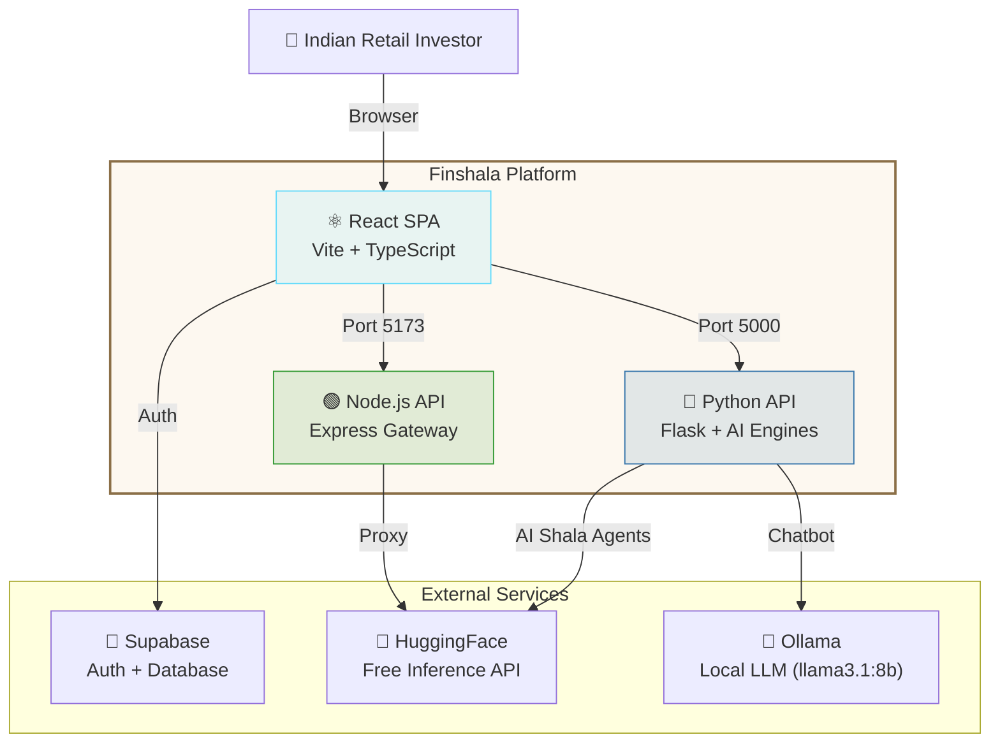
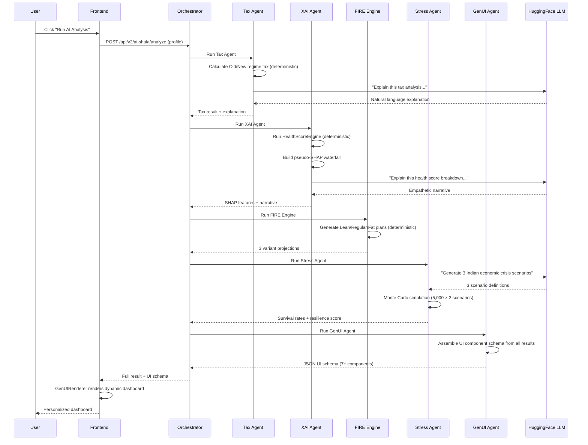

# Finshala
<!-- ═══════════════════════════════════════════════════════════════ -->
<!-- FINSHALA — README.md                                          -->
<!-- Economic Times GenAI Hackathon 2026 · Finance & Fintech Track -->
<!-- ═══════════════════════════════════════════════════════════════ -->

<p align="center">
  
</p>

<h1 align="center">Finshala</h1>

<p align="center">
  <b>AI-Powered Financial Wellness for 150M+ Indian Retail Investors</b><br />
  <i>Economic Times GenAI Hackathon 2026 — Finance & Fintech Track</i>
</p>

<p align="center">
  <a href="#-demo-video"></a>
  <a href="#-quick-start"></a>
  <a href="#-ai-shala--agentic-intelligence"></a>
</p>

<p align="center">
  
  
  
  
  
  
  
  
  
  
</p>

---

## 📋 Table of Contents

- [The Problem We Solve](#-the-problem-we-solve)
- [What Finshala Does](#-what-finshala-does)
- [Demo Video](#-demo-video)
- [Core Features](#-core-features)
- [AI Shala — Agentic Intelligence](#-ai-shala--agentic-intelligence)
- [System Architecture](#-system-architecture)
- [Tech Stack](#-tech-stack)
- [Quick Start](#-quick-start)
- [Project Structure](#-project-structure)
- [API Reference](#-api-reference)
- [GenAI Integration Deep Dive](#-genai-integration-deep-dive)
- [Business Impact & ROI](#-business-impact--roi)
- [Scalability & Cost Analysis](#-scalability--cost-analysis)
- [Screenshots](#-screenshots)
- [Testing](#-testing)
- [Roadmap](#-roadmap)
- [Team](#-team)
- [Acknowledgments](#-acknowledgments)
- [License](#-license)

---

## 🎯 The Problem We Solve

India has **150+ million retail investors**, and this number is growing every day. But most of these people face a big problem:

> **Financial advice is either too expensive for normal people, or too generic to be useful.**

- A personal financial advisor in India charges ₹15,000–₹50,000 per year — too costly for a young professional earning ₹6–12 LPA.
- Free online tools give the same cookie-cutter advice to everyone: *"Invest in ELSS"*, *"Start a SIP"* — without knowing your actual salary, loans, tax situation, or goals.
- Most Indians don't know if they are using the right tax regime. The difference between Old and New regime can be ₹30,000–₹80,000 per year — real money that gets lost.
- Nobody explains **why** their financial health is good or bad. You get a number, but not the reasoning behind it.

### The Information Gap in Numbers

| Problem | Scale |
|---------|-------|
| Indians who file wrong tax regime annually | ~40 million |
| Average tax overpayment per person (wrong regime) | ₹25,000–₹60,000 |
| Young professionals with zero financial plan | 78% (under age 35) |
| Average cost of a certified financial planner | ₹25,000/year |
| People who abandon financial apps due to complexity | 65% |

**Finshala bridges this gap.** We use Generative AI to give every Indian the kind of personalized, data-driven financial guidance that was previously available only to the wealthy.

---

## 💡 What Finshala Does

Finshala is a full-stack financial wellness platform that combines **deterministic computation engines** (for accurate math) with **Generative AI agents** (for personalized advice and explanations). No hallucinated numbers — the LLMs explain, they never calculate.

### In Simple Words

You enter your financial details once. Finshala then:

1. **Scans your tax situation** → Tells you which regime saves more money and exactly where you're missing deductions
2. **Checks your financial health** → Gives you a score out of 900 across 6 dimensions (like a CIBIL score, but for overall financial fitness)
3. **Plans your retirement** → Shows you exactly when you can retire early (FIRE), how much SIP you need, and what happens year by year
4. **Explains everything with AI** → Not just numbers, but *why* your score is what it is, using SHAP-style explainable AI
5. **Stress-tests your money** → Runs 5,000 Monte Carlo simulations against AI-generated economic crisis scenarios
6. **Generates PDF reports** → Professional, downloadable reports for Tax, Health Score, and FIRE planning

---

## 🎬 Demo Video

<p align="center">
  <a href="https://youtu.be/YOUR_VIDEO_ID">
    
  </a>
</p>

<p align="center">
  <i>▶ Click the image above to watch the full demo (2 minutes)</i>
</p>

### Demo Flow — Timestamp Guide

| Timestamp | What You'll See |
|-----------|----------------|
| `0:00 – 0:15` | Landing page with interactive glass panels and animated hero |
| `0:15 – 0:35` | Financial profile onboarding (income, expenses, loans, goals) |
| `0:35 – 0:55` | FIRE Dashboard — Lean/Regular/Fat retirement projections with year-by-year roadmap |
| `0:55 – 1:15` | Money Health Score — 6-dimension radar with AI explanations |
| `1:15 – 1:35` | Tax Wizard — Form 16 PDF upload, regime comparison, missed deductions |
| `1:35 – 1:55` | AI Shala — Full 5-agent agentic pipeline with GenUI rendering |
| `1:55 – 2:10` | PDF report generation and AI chatbot interaction |

---

## 🔥 Core Features

### 1. 🏔️ FIRE Path Planner — *Journey to Financial Independence*

The FIRE (Financial Independence, Retire Early) engine calculates three retirement scenarios based on your real data:

| Variant | What It Means | Example Target |
|---------|--------------|----------------|
| 🌿 **Lean FIRE** | Basics only — no dining out, no vacations | ₹1.4 Cr by age 38 |
| 🔥 **Regular FIRE** | Keep your current lifestyle without working | ₹3.7 Cr by age 44 |
| 👑 **Fat FIRE** | Premium living — international travel, luxury | ₹7.2 Cr by age 50 |

**What makes it special:**
- Month-by-month simulation up to age 85
- Age-based asset allocation glide path (more equity when young, more debt when older)
- SIP breakdown by fund type (flexi-cap, mid-cap, ELSS, debt, gold ETF)
- Automatic milestone tracking (25% done → Coast FIRE → 50% → FIRE achieved!)
- Built-in insurance gap analysis (life + health + critical illness)
- Tax regime comparison embedded in the FIRE plan
- Emergency fund strategy with specific parking recommendations

### 2. 💊 Money Health Score — *Your 6-Dimension Financial Pulse*

A comprehensive score from 0 to 900 (like a CIBIL score, but for your complete financial wellness):

| Dimension | Weight | What It Measures |
|-----------|--------|-----------------|
| 🛡️ Emergency Preparedness | 20% | Months of expenses covered by liquid savings |
| 🏥 Insurance Coverage | 20% | Life, health, and critical illness adequacy |
| 📊 Investment Diversification | 15% | Asset classes, concentration risk, SIP discipline |
| 💳 Debt Health | 15% | EMI-to-income ratio, debt quality (secured vs unsecured) |
| 🏛️ Tax Efficiency | 15% | 80C/80D/NPS utilization, regime optimization |
| 🏖️ Retirement Readiness | 15% | Corpus progress, SIP adequacy, years to goal |

Each dimension gives you:
- A sub-score with detailed breakdown
- Specific findings (✅ positive, ⚠️ warning, 🚨 critical)
- Prioritized, actionable recommendations with estimated impact

### 3. 🧮 Tax Wizard — *AI-Driven Regime Optimization*

- **Upload your Form 16 PDF** → Automatically extracts salary, deductions, TDS (handles password-protected PDFs too)
- **Old vs New Regime comparison** → Shows exact tax under both, recommends the better one
- **Missed deduction finder** → Scans 80C, 80CCD(1B), 80D, Section 24(b) and tells you exactly how much more to invest
- **Slab-by-slab breakdown** → See how tax is calculated at each income slab
- **AI explanation** → LLM explains in plain language *why* one regime is better for your specific situation

### 4. 🤖 AI Chatbot — *Your Personal Finance Assistant*

A conversational AI assistant powered by **Ollama (Llama 3.1 8B)** for local inference:
- Answers tax questions in context of Indian law (FY 2024-25)
- Gives investment advice using Indian products (SIP, ELSS, PPF, NPS)
- Explains financial concepts in simple Hindi/English
- Keeps conversation history for follow-up questions
- Falls back to HuggingFace API if Ollama is not running

### 5. 📄 PDF Report Generator

Professional, branded reports generated on the server using Python ReportLab:
- **FIRE Report** — 11 sections covering everything from profile snapshot to 20-year roadmap
- **Tax Report** — Regime comparison, deduction utilization, missed savings
- **Health Score Report** — 6-dimension breakdown, findings, prioritized action plan
- All reports include copper-themed branding, formatted tables, and page numbers

---

## 🧠 AI Shala — Agentic Intelligence

**AI Shala** is the heart of Finshala's GenAI innovation. It is a **multi-agent orchestration system** where 5 specialized AI agents collaborate in a sequential pipeline to analyze your finances from every angle.

### How the Agent Pipeline Works

```
User Profile → [Tax Agent] → [XAI Agent] → [FIRE Agent] → [Stress Agent] → [GenUI Agent] → Dynamic Dashboard
```

Each agent adds its results to a shared state. The pipeline runs end-to-end and produces a dynamic dashboard that is different for every user.

### The Five Agents

| # | Agent | What It Does | Engine Type |
|---|-------|-------------|-------------|
| 1 | 🏛️ **Tax Agent** | Calculates Old vs New regime tax, finds deduction gaps, asks LLM to explain | Deterministic + LLM narrative |
| 2 | 🔍 **XAI Agent** | Runs Health Score engine, decomposes into SHAP-style waterfall | Deterministic + LLM narrative |
| 3 | 🔥 **FIRE Agent** | Generates Lean/Regular/Fat FIRE projections | Pure deterministic (Python) |
| 4 | 🌊 **Stress Agent** | LLM generates 3 economic crisis scenarios, Monte Carlo simulates 5,000 runs each | LLM scenarios + Monte Carlo math |
| 5 | 🎨 **GenUI Agent** | Reads all results, assembles a JSON UI schema | Conditional logic |

### Key Design Principle

> **LLMs explain. They NEVER calculate.**
>
> All financial math (tax slabs, compound interest, SIP projections, Monte Carlo simulations) runs through deterministic Python engines. The LLMs only generate human-readable narratives and scenario descriptions. This prevents hallucinated numbers — a critical requirement for financial applications.

### Explainable AI (XAI) — SHAP-Style Decomposition

The XAI Agent doesn't just give you a health score — it shows you exactly **which dimensions pushed your score up or down**, similar to SHAP (SHapley Additive exPlanations) values in ML:

```
Base Score (Population Average): 480/900
  + Tax Efficiency:        +58 points  ✅ (Your strongest area)
  + Debt Health:           +42 points  ✅ 
  - Emergency Fund:        -72 points  🚨 (Only 1.4 months covered)
  - Insurance Coverage:    -61 points  ⚠️ (No life insurance)
  - Retirement Readiness:  -35 points  ⚠️
  + Investment:            +12 points
  ────────────────────────────────────
  Your Score:              424/900     (Fair)
```

### Monte Carlo Stress Testing

The Stress Agent generates realistic Indian economic crisis scenarios using GenAI, then runs **5,000 random simulations** for each scenario:

**Example scenarios generated by the LLM:**
1. 🏚️ *Indian Stagflation 2028* — Inflation hits 9.5%, equity returns drop to 4% for 5 years
2. 📉 *Market Correction 2029* — 35% crash from global tech bubble, 3-year slow recovery
3. 🦠 *Black Swan Pandemic 2030* — 15% salary cuts, 8% inflation, extreme volatility for 2 years

For each scenario, you get:
- **Survival probability** — Will your money last until retirement?
- **Median final corpus** — Most likely outcome
- **Worst case (5th percentile)** — What happens if everything goes wrong
- **Resilience score** — Overall stress resistance rating

### Generative UI (GenUI)

The GenUI Agent reads all analysis results and dynamically builds a component schema. The frontend `GenUIRenderer` component reads this JSON and renders a personalized dashboard — no hard-coded layouts. Different users see different dashboards based on their financial situation.

Components generated include:
- `HealthScoreGauge` — Always shown
- `ShapWaterfall` — Always shown (key differentiator)
- `StressTestSimulator` — If stress results exist
- `TaxOptimizationCard` — If there are tax savings available
- `FireTrajectoryChart` — If FIRE data exists
- `DebtAvalancheModule` — Only if EMI-to-income ratio is concerning
- `ActionableCards` — Always shown with prioritized next steps

---

## 🏗️ System Architecture

### High-Level Architecture (C4 — Level 1: System Context)



### Detailed Architecture (C4 — Level 2: Container)

```mermaid
graph LR
    subgraph Frontend["Frontend (React + Vite)"]
        Pages["📄 Pages<br/>Index, FIRE, Health,<br/>Tax Wizard, AI Shala"]
        Components["🧩 Components<br/>HeroPanels, Navbar,<br/>GenUIRenderer, Chatbot"]
        Services["⚙️ Services<br/>fire-engine.ts<br/>health-score-engine.ts<br/>tax-wizard-engine.ts<br/>llm-service.ts"]
        Hooks["🪝 Hooks<br/>useAuth, useUserProfile,<br/>useCountUp"]
    end
    
    subgraph NodeBackend["Node.js Backend (Express)"]
        HealthAPI["GET /api/health"]
        LLMProxy["POST /api/llm/proxy"]
        StaticServe["Static File Serving<br/>(Production)"]
    end
    
    subgraph PythonBackend["Python Backend (Flask)"]
        Form16["POST /api/parse-form16<br/>PDF Parser (pdfplumber)"]
        HealthScore["POST /api/calculate-health-score<br/>6-Dimension Engine"]
        FIREPlan["POST /api/calculate-fire-plan<br/>FIRE Engine"]
        Reports["POST /api/generate-report/:type<br/>PDF Generator (ReportLab)"]
        Chat["POST /api/chat<br/>Ollama Chatbot"]
        
        subgraph AIShala["AI Shala Module"]
            Orchestrator["🎯 Orchestrator"]
            TaxAgent["🏛️ Tax Agent"]
            XAIAgent["🔍 XAI Agent"]
            StressAgent["🌊 Stress Agent"]
            GenUIAgent["🎨 GenUI Agent"]
            LLMClient["🤗 LLM Client<br/>(HuggingFace Router)"]
        end
    end
    
    Pages --> Services
    Pages --> Hooks
    Services --> NodeBackend
    Services --> PythonBackend
    Orchestrator --> TaxAgent
    TaxAgent --> XAIAgent
    XAIAgent --> StressAgent
    StressAgent --> GenUIAgent
    TaxAgent --> LLMClient
    XAIAgent --> LLMClient
    StressAgent --> LLMClient
    
    style Frontend fill:#f0f9ff,stroke:#61DAFB
    style NodeBackend fill:#f0fff0,stroke:#339933
    style PythonBackend fill:#f0f0ff,stroke:#3776AB
    style AIShala fill:#fdf8f022,stroke:#8B6F47,stroke-width:2px,stroke-dasharray: 5 5
```



### AI Shala — Agent Pipeline Flow



---

## 🛠️ Tech Stack

### Frontend

| Technology | Purpose |
|-----------|---------|
| **React 18** + **TypeScript** | UI framework with type safety |
| **Vite 5** | Fast build tool with HMR (hot module replacement) |
| **Tailwind CSS** + **shadcn/ui** | Styling system with accessible Radix UI components |
| **Framer Motion** + **GSAP** | Smooth animations and micro-interactions |
| **Three.js** | 3D shader effects for hero background |
| **Recharts** | Interactive financial charts and graphs |
| **React Router 6** | Client-side page routing |
| **TanStack Query** | Server state management and caching |
| **Supabase JS** | Authentication (email, OAuth) |
| **Zod** + **React Hook Form** | Form validation |

### Backend — Node.js

| Technology | Purpose |
|-----------|---------|
| **Express 4** | API gateway and static file serving |
| **CORS** | Cross-origin request handling |
| **dotenv** | Environment variable management |

### Backend — Python

| Technology | Purpose |
|-----------|---------|
| **Flask 3.1** | REST API framework |
| **pdfplumber** | Form 16 PDF text extraction |
| **pikepdf** | Password-protected PDF handling |
| **ReportLab** | Professional PDF report generation |
| **httpx** | Async HTTP client for LLM API calls |
| **NumPy** | Monte Carlo simulation math |

### AI / LLM

| Technology | Purpose |
|-----------|---------|
| **Ollama** (llama3.1:8b) | Local fast inference for chatbot |
| **HuggingFace Router v1** | Cloud LLM inference for AI Shala agents |
| **Meta Llama 3.1 8B** | Primary model for agent narratives |
| **Microsoft Phi-3.5 Mini** | Fast fallback model |
| **Mistral 7B v0.3** | Backup fallback model |
| **Qwen 2.5 72B / Mixtral 8x22B** | Frontend LLM service for tax Q&A and reports |

### Infrastructure

| Technology | Purpose |
|-----------|---------|
| **Supabase** | Authentication, user data, and future database needs |
| **Vitest** | Unit testing framework |
| **Playwright** | End-to-end browser testing |
| **ESLint** | Code quality and linting |

---

## 🚀 Quick Start

### What You Need

| Requirement | Version | Why |
|------------|---------|-----|
| **Node.js** | 20.x or higher | Runs frontend and Node.js backend |
| **Python** | 3.11 or higher | Runs Flask API and AI engines |
| **npm** | 10.x or higher | Package management |
| **Git** | Any recent version | Clone the repository |
| **Ollama** *(optional)* | Latest | For local AI chatbot (llama3.1:8b) |

### Step 1 — Clone the Repository

```bash
git clone https://github.com/YOUR_USERNAME/finshala.git
cd finshala
```

### Step 2 — Set Up Environment Variables

**Frontend** (`frontend/.env`):
```bash
cp frontend/.env.example frontend/.env
```
Then edit `frontend/.env` and fill in your keys:
```env
VITE_SUPABASE_URL="https://YOUR_PROJECT_ID.supabase.co"
VITE_SUPABASE_ANON_KEY="your.anon.key.here"
VITE_HF_API_KEY="hf_your_huggingface_api_key_here"
```

**Backend** (`backend/.env`):
```bash
cp backend/.env.example backend/.env
```
Then edit `backend/.env`:
```env
HF_API_KEY="hf_your_huggingface_api_key_here"
```

> **Where to get API keys:**
> - **Supabase**: Sign up at [supabase.com](https://supabase.com), create a project, copy the URL and anon key from Settings → API
> - **HuggingFace**: Sign up at [huggingface.co](https://huggingface.co), go to Settings → Access Tokens, create a free token
> - **Note**: Finshala works even without API keys — it falls back to intelligent mock responses

### Step 3 — Install and Start Everything

Open **three separate terminal windows**:

**Terminal 1 — Frontend (React)**
```bash
cd frontend
npm install
npm run dev
```
→ Opens at `http://localhost:5173`

**Terminal 2 — Node.js Backend**
```bash
cd backend
npm install
npm run dev
```
→ Runs at `http://localhost:3000`

**Terminal 3 — Python API**
```bash
cd backend/python_api
python -m venv .venv

# Windows:
.venv\Scripts\activate
# macOS/Linux:
source .venv/bin/activate

pip install -r requirements.txt
python app.py
```
→ Runs at `http://localhost:5000`

### Step 4 — (Optional) Start Ollama for AI Chatbot

```bash
ollama pull llama3.1:8b
ollama run llama3.1:8b
```
→ The chatbot on Finshala will now use local AI inference

### Step 5 — Open the App

Visit **http://localhost:5173** in your browser. That's it! 🎉

### One-Command Health Check

After everything is running, verify all systems work:

```bash
# Check Node.js backend
curl http://localhost:3000/api/health

# Check Python API
curl http://localhost:5000/api/health

# Check AI Shala subsystem
curl http://localhost:5000/api/v2/ai-shala/health
```

All three should return `{"status": "ok"}`.

---

## 📁 Project Structure

```
finshala/
├── frontend/                       # React + Vite + TypeScript
│   ├── src/
│   │   ├── App.tsx                 # Root component with route definitions
│   │   ├── main.tsx                # Entry point
│   │   ├── index.css               # Global styles (parchment & ink theme)
│   │   │
│   │   ├── pages/
│   │   │   ├── Index.tsx           # Landing page (hero + feature sections)
│   │   │   ├── FireDashboard.tsx   # FIRE planning dashboard (40KB — most complex page)
│   │   │   ├── MoneyHealthPage.tsx # Health score assessment page
│   │   │   ├── TaxWizardPage.tsx   # Tax optimization with Form 16 upload
│   │   │   ├── AiShalaPage.tsx     # AI Shala — agentic pipeline interface
│   │   │   ├── Account.tsx         # User profile management (20KB)
│   │   │   └── NotFound.tsx        # 404 page
│   │   │
│   │   ├── components/
│   │   │   ├── Navbar.tsx          # Navigation with auth integration
│   │   │   ├── HeroPanels.tsx      # Interactive glass panels on landing page
│   │   │   ├── FeatureFirePath.tsx  # FIRE feature showcase section
│   │   │   ├── FeatureMoneyHealth.tsx # Health score feature section
│   │   │   ├── FeatureTaxWizard.tsx   # Tax wizard feature section
│   │   │   ├── FeatureAiShala.tsx     # AI Shala feature section
│   │   │   ├── AuthModal.tsx       # Login/signup modal
│   │   │   ├── ProfileGate.tsx     # Ensures user completes profile
│   │   │   │
│   │   │   ├── ai-shala/           # AI Shala components
│   │   │   │   └── GenUIRenderer.tsx  # Renders dynamic UI from JSON schema
│   │   │   ├── health-score/       # Health score visualization components
│   │   │   ├── tax-wizard/         # Tax wizard UI components
│   │   │   ├── onboarding/         # Onboarding flow components
│   │   │   │
│   │   │   └── ui/                 # 68 reusable UI components
│   │   │       ├── GlobalChatbot.tsx       # AI chatbot interface
│   │   │       ├── PulsingCircle.tsx       # Chatbot trigger button
│   │   │       ├── liquid-glass.tsx        # Glassmorphism effects
│   │   │       ├── hero-section-with-smooth-bg-shader.tsx  # 3D shader background
│   │   │       ├── orbiting-skills.tsx     # AI Shala orbiting animation
│   │   │       ├── modern-animated-hero-section.tsx  # Matrix rain effect
│   │   │       └── ... (65 more shadcn/ui components)
│   │   │
│   │   ├── services/
│   │   │   ├── fire-engine.ts      # FIRE calculation engine (TypeScript port)
│   │   │   ├── health-score-engine.ts  # Health score engine (TypeScript port)
│   │   │   ├── tax-wizard-engine.ts    # Tax calculation engine
│   │   │   ├── llm-service.ts      # HuggingFace LLM client with fallback chains
│   │   │   ├── form16-parser.ts    # Form 16 PDF text parsing
│   │   │   └── pdf-generator.ts    # Client-side PDF utilities
│   │   │
│   │   ├── hooks/
│   │   │   ├── useAuth.tsx         # Supabase authentication hook
│   │   │   ├── useUserProfile.ts   # LocalStorage profile management
│   │   │   ├── useCountUp.ts       # Animated number counter
│   │   │   └── use-mobile.tsx      # Responsive breakpoint detection
│   │   │
│   │   └── data/
│   │       └── fireMockData.ts     # Mock data for development
│   │
│   ├── package.json                # Frontend dependencies
│   ├── tailwind.config.ts          # Parchment & ink design tokens
│   ├── vite.config.ts              # Vite build configuration
│   └── vitest.config.ts            # Test configuration
│
├── backend/                        # Node.js API Gateway
│   ├── server.js                   # Express server (LLM proxy, health check)
│   ├── package.json                # Backend dependencies
│   ├── .env.example                # Environment variable template
│   │
│   └── python_api/                 # Python Flask API (Core Intelligence)
│       ├── app.py                  # Main Flask app (all route registrations)
│       ├── fire_engine.py          # FIRE planning engine (833 lines)
│       ├── health_score_engine.py  # Health score engine (637 lines)
│       ├── report_generator.py     # PDF report generator (929 lines)
│       ├── requirements.txt        # Python dependencies
│       │
│       ├── ai_shala/               # Agentic AI Module
│       │   ├── __init__.py
│       │   ├── orchestrator.py     # Sequential multi-agent pipeline
│       │   ├── llm_client.py       # HuggingFace LLM client (3-model fallback)
│       │   ├── routes.py           # Flask blueprint (/api/v2/ai-shala/*)
│       │   │
│       │   └── agents/             # Specialized AI Agents
│       │       ├── tax_agent.py    # Tax optimization analysis
│       │       ├── xai_agent.py    # Explainable AI health decomposition
│       │       ├── stress_agent.py # Monte Carlo stress testing
│       │       └── genui_agent.py  # Dynamic UI schema assembly
│       │
│       └── test_*.py               # API test scripts
│
├── .gitignore                      # Git ignore rules
└── README.md                       # You are here
```

---

## 📡 API Reference

### Python API (Port 5000)

| Method | Endpoint | Description |
|--------|----------|-------------|
| `GET` | `/api/health` | Health check |
| `POST` | `/api/parse-form16` | Upload and parse Form 16 PDF (multipart/form-data) |
| `POST` | `/api/calculate-health-score` | Calculate 6-dimension financial health score |
| `POST` | `/api/calculate-fire-plan` | Generate Lean/Regular/Fat FIRE projections |
| `POST` | `/api/generate-report/:type` | Generate PDF report (`fire`, `tax`, or `health`) |
| `POST` | `/api/chat` | AI chatbot (Ollama llama3.1:8b) |
| `GET` | `/api/v2/ai-shala/health` | AI Shala subsystem health check |
| `POST` | `/api/v2/ai-shala/analyze` | **Full 5-agent agentic pipeline** |
| `POST` | `/api/v2/ai-shala/explain-score` | Standalone XAI health score explanation |
| `POST` | `/api/v2/ai-shala/stress-test` | Standalone Monte Carlo stress testing |

### Node.js API (Port 3000)

| Method | Endpoint | Description |
|--------|----------|-------------|
| `GET` | `/api/health` | Health check |
| `POST` | `/api/llm/proxy` | Secure proxy to HuggingFace (hides API key from frontend) |

### Example: Run the Full AI Pipeline

```bash
curl -X POST http://localhost:5000/api/v2/ai-shala/analyze \
  -H "Content-Type: application/json" \
  -d '{
    "gross_annual_income": 1800000,
    "monthly_expenses": 45000,
    "dob": "1995-06-15",
    "emergency_fund": 100000,
    "mutual_fund_value": 300000,
    "stock_value": 50000,
    "savings_fd_balance": 200000,
    "monthly_sip": 15000,
    "tax_80c_investments": 110000,
    "tax_80d_medical": 12000,
    "current_tax_regime": "new",
    "risk_profile": "moderate"
  }'
```

**Response includes:**
- `ui_schema` — Dynamic component layout for the frontend
- `insights.health_score` — Overall score out of 900
- `insights.shap_explanation` — SHAP-style waterfall data
- `insights.tax_optimization` — Regime recommendation + missed deductions
- `insights.stress_test` — 3 scenarios with survival probabilities
- `insights.fire_summary` — FIRE numbers for all 3 variants
- `pipeline_log` — Per-agent status and latency
- `total_latency_ms` — End-to-end pipeline time

---

## 🤖 GenAI Integration Deep Dive

### How We Use AI — The "Math ≠ LLM" Principle

Finshala follows a strict separation between **mathematical computation** and **language generation**:

```
┌──────────────────────────┐     ┌──────────────────────────┐
│  DETERMINISTIC ENGINES   │     │  GENERATIVE AI (LLMs)    │
│  (Python / TypeScript)   │     │  (HuggingFace / Ollama)  │
├──────────────────────────┤     ├──────────────────────────┤
│ ✅ Tax slab calculations │     │ ✅ Explain WHY one regime │
│ ✅ Compound interest     │     │    is better             │
│ ✅ SIP projections       │     │ ✅ Generate crisis        │
│ ✅ Monte Carlo sims      │     │    scenario descriptions │
│ ✅ Health scoring logic  │     │ ✅ Write health score     │
│ ✅ FIRE number math      │     │    narratives            │
│ ❌ Never asks LLM for   │     │ ✅ Answer user questions  │
│    a number              │     │ ❌ Never does math       │
└──────────────────────────┘     └──────────────────────────┘
```

### LLM Model Strategy

We use **multiple models** with automatic fallback chains — so the app keeps working even if one model is down:

**Python Backend (AI Shala Agents):**
```
Primary:  Meta Llama 3.1 8B Instruct (via Novita)
Fast:     Microsoft Phi-3.5 Mini Instruct (via Novita)
Backup:   Mistral 7B Instruct v0.3 (via Novita)
Offline:  Intelligent mock responses (hardcoded)
```

**Frontend (LLM Service):**
```
Tax Math:   Qwen 2.5 72B Instruct → Qwen 2.5 7B → Mixtral 8x22B
Advice:     Mixtral 8x22B → Qwen 72B → Qwen 7B
Parser:     Qwen 2.5 Coder 7B → Qwen 72B
Reports:    Qwen3 235B → Qwen 72B → Mixtral 8x22B
Planner:    Cohere Command-R+ → Mixtral 8x22B → Qwen 72B
Chatbot:    Ollama llama3.1:8b (local) → HF fallback
```

### Prompt Engineering Highlights

Every LLM call uses carefully crafted system prompts. For example, the Tax Agent prompt:

```
You are a Chartered Accountant AI specializing in Indian Income Tax (FY 2024-25).
Explain tax recommendations clearly in 3-4 sentences.
Use INR amounts. Be specific.
```

The XAI Agent uses a different tone:

```
You are a financial wellness coach.
Explain health scores in a warm, motivational yet honest tone.
Use Indian financial context.
Keep to 4-5 sentences maximum.
```

This task-specific prompting ensures that each agent sounds different and appropriate for its role.

---

## 📊 Business Impact & ROI

### Who Benefits and How Much They Save

| User Segment | Problem Solved | Estimated Annual Saving |
|-------------|---------------|----------------------|
| **Salaried Professional** (₹8–15 LPA) | Wrong tax regime + missed 80C/80D deductions | ₹25,000 – ₹65,000/year |
| **Young Investor** (25–35 years) | No FIRE plan, no emergency fund awareness | Starts building ₹10L+ corpus over 5 years |
| **Family with Loans** | Doesn't know credit card debt costs 36% interest | Saves ₹12,000 – ₹40,000/year by prioritizing payoff |
| **Mid-Career Professional** (35–45) | Inadequate insurance coverage | Prevents ₹5–30L out-of-pocket medical expenses |

### Impact Math (Conservative Estimates)

```
Time to complete FIRE onboarding:             ~8 minutes
Time with a traditional financial planner:    ~3 hours + ₹5,000 consultation fee

Time saved per user:                          2 hours 52 minutes
Value of time saved (at ₹500/hr):             ₹1,430 per user

If 10,000 users complete onboarding:
  Total time saved:                           28,666 hours
  Total consultation fees saved:              ₹5,00,00,000 (₹5 Cr)
  Average tax savings identified:             ₹35,000 × 10,000 = ₹35 Cr
```

### India-First Problem Alignment

| ET Hackathon Theme | How Finshala Addresses It |
|-------------------|--------------------------|
| **Financial Inclusion** | Free access to advice that used to cost ₹25K/year. Works in simple English — no jargon. |
| **Digital India** | Fully web-based, works on any device. PDF reports work offline. No app download needed. |
| **Youth Empowerment** | FIRE planning helps 25-year-olds see a realistic path to retirement by 40–45. |
| **Tax Efficiency** | Directly prevents ₹25K–₹60K annual tax overpayment for millions of Indians. |

---

## 📈 Scalability & Cost Analysis

### Current Architecture — Ready for Scale

| Component | Current Setup | Scale-Ready Path |
|-----------|--------------|-----------------|
| Frontend | Vite dev server | Deploy to Vercel/Netlify (auto-scaling CDN) |
| Node.js API | Single Express instance | Dockerize → deploy to AWS ECS / Railway |
| Python API | Single Flask instance | Gunicorn + Docker → Kubernetes with HPA |
| Database | Supabase (managed Postgres) | Already scalable — handles 10K+ concurrent users |
| LLM Inference | HuggingFace Free Tier | Upgrade to HF Pro ($9/mo) or deploy quantized models on GPU |

### LLM Cost Projection

| Scale | Monthly LLM API Calls | Estimated Cost | Strategy |
|-------|----------------------|----------------|----------|
| **Prototype** (now) | ~1,000 | ₹0 (HF free tier) | Free inference + Ollama local |
| **1K users/month** | ~15,000 | ~₹750 | HF Pro ($9/mo) |
| **10K users/month** | ~150,000 | ~₹4,500 | Self-hosted Llama 3.1 on a single A10G GPU |
| **100K users/month** | ~1.5M | ~₹25,000 | Quantized model (GGUF 4-bit) on 2× A10G |

> **Key insight:** The most expensive operations (Monte Carlo simulations, tax calculations, health scoring) are **pure Python math** — they cost zero LLM tokens. Only narrative generation and scenario creation use LLM calls.

### Token Optimization Strategies Used

1. **Short system prompts** — Average 50 tokens, not 500
2. **Output token limits** — Each agent caps at 250–300 tokens
3. **Mock fallback** — App works fully even with zero API calls
4. **Task-specific models** — Use small models (Phi-3.5, 3.8B params) for simple tasks, large models only when needed
5. **No streaming** — Single request-response to minimize connection overhead

---

## 📸 Screenshots

> *Add your screenshots here. Recommended sections:*

### Landing Page
`<!--  -->`

### FIRE Dashboard
`<!--  -->`

### Money Health Score
`<!--  -->`

### Tax Wizard
`<!--  -->`

### AI Shala — Agentic Pipeline
`<!--  -->`

### PDF Reports
`<!--  -->`

---

## 🧪 Testing

### Run Unit Tests

```bash
cd frontend
npm run test          # Single run
npm run test:watch    # Watch mode
```

### Test the Python API

```bash
cd backend/python_api
python test_all_apis.py    # Tests all API endpoints
python test_engine.py      # Tests FIRE engine
python test_llm.py         # Tests LLM connectivity
```

### API Health Checks

```bash
# All three services should return {"status": "ok"}
curl http://localhost:3000/api/health      # Node.js
curl http://localhost:5000/api/health      # Python
curl http://localhost:5000/api/v2/ai-shala/health  # AI Shala
```

---

## 🗺️ Roadmap

### Phase 1 — Hackathon MVP ✅ (Current)
- [x] FIRE Planner (Lean / Regular / Fat)
- [x] Money Health Score (6 dimensions)
- [x] Tax Wizard with Form 16 parsing
- [x] AI Shala — 5-agent agentic pipeline
- [x] Explainable AI (SHAP-style waterfall)
- [x] Monte Carlo stress testing
- [x] Generative UI (dynamic dashboards)
- [x] PDF report generation
- [x] AI chatbot (Ollama + HF fallback)
- [x] Supabase authentication

### Phase 2 — Post-Hackathon (Q2 2026)
- [ ] Mobile-responsive redesign (PWA)
- [ ] Hindi and regional language support
- [ ] Real mutual fund data integration (AMFI NAV API)
- [ ] Goal-based investment tracking
- [ ] Budget tracker with UPI data import

### Phase 3 — Product (Q3–Q4 2026)
- [ ] WhatsApp chatbot (for Tier 2/3 city users)
- [ ] SEBI-registered advisory partnerships
- [ ] B2B API for employers (corporate wellness)
- [ ] Open-source community edition

---

## 👥 Team

<!-- Add your team details here -->

| Name | Role | LinkedIn |
|------|------|----------|
| *Your Name* | Full-Stack Developer & AI Engineer | [LinkedIn](#) |
| *Team Member 2* | *Role* | [LinkedIn](#) |

---

## 🙏 Acknowledgments

- **Economic Times & Unstop** — For organizing the ET GenAI Hackathon 2026
- **HuggingFace** — For the free inference API that makes GenAI accessible to everyone
- **Meta AI** — For open-sourcing Llama 3.1
- **Ollama** — For making local LLM inference simple
- **Supabase** — For the generous free tier on authentication and database
- **shadcn/ui** + **Radix UI** — For the beautiful, accessible component library
- **The open-source community** — For React, Vite, Flask, ReportLab, and hundreds of other tools that made this possible

---

## 📜 License

This project is open-source under the [MIT License](LICENSE).

```
MIT License

Copyright (c) 2026 Finshala

Permission is hereby granted, free of charge, to any person obtaining a copy
of this software and associated documentation files (the "Software"), to deal
in the Software without restriction, including without limitation the rights
to use, copy, modify, merge, publish, distribute, sublicense, and/or sell
copies of the Software, and to permit persons to whom the Software is
furnished to do so, subject to the following conditions:

The above copyright notice and this permission notice shall be included in all
copies or substantial portions of the Software.
```

---

<p align="center">
  <b>Built with ❤️ for India's financial future</b><br />
  <i>ET GenAI Hackathon 2026 — Finance & Fintech Track</i>
</p>

<p align="center">
  
</p>
