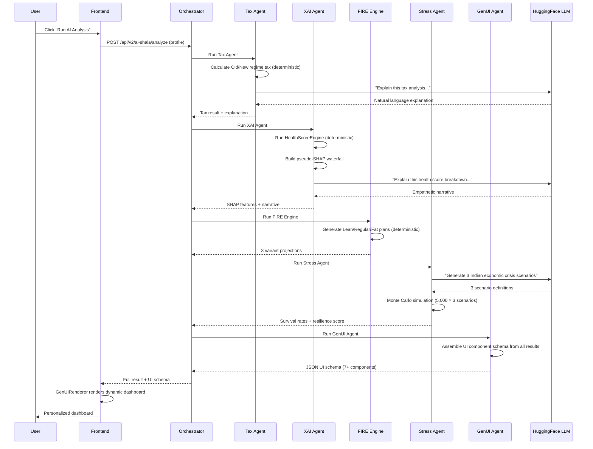

<div align="center">

# Finshala

**AI-powered financial wellness for India's 150M+ retail investors.**

*Economic Times GenAI Hackathon 2026 — Finance & Fintech Track*

[](https://finshala-production.up.railway.app/)
&nbsp;
[](https://youtu.be/EZbtbZWgScs)
&nbsp;
[](https://react.dev)
[](https://typescriptlang.org)
[](https://python.org)
[](https://flask.palletsprojects.com)
[](https://supabase.com)
[](https://vitejs.dev/)
[](https://nodejs.org/)

</div>

---

## ● Table of Contents

- [The Problem We Solve](#the-problem-we-solve)
- [What is Finshala?](#what-is-finshala)
- [Features](#features)
- [System Architecture](#system-architecture)
- [GenAI Integration Deep Dive](#genai-integration-deep-dive)
- [Tech Stack](#tech-stack)
- [Project Structure](#project-structure)
- [Running Locally](#running-locally)
- [Testing](#testing)
- [Impact & Business ROI](#impact)
- [Screenshots](#screenshots)
- [Team](#team)
- [Acknowledgments](#acknowledgments)

---

<a id="the-problem-we-solve"></a>
## ● The Problem We Solve

India has **150+ million retail investors**, and this number is growing every day. But most of these people face a big problem:

> **Financial advice is either too expensive for normal people, or too generic to be useful.**

- A personal financial advisor in India charges ₹15,000–₹50,000 per year too costly for a young professional earning ₹6–12 LPA.
- Free online tools give the same advice to everyone: *"Invest in ELSS"*, *"Start a SIP"* — without knowing your actual salary, loans, tax situation, or goals.
- Most Indians don't know if they are using the right tax regime. The difference between Old and New regime can be ₹30,000–₹80,000 per year real money that gets lost.
- Nobody explains **why** their financial health is good or bad you get a number but not the reasoning behind it.

### The Information Gap in Numbers

| Problem | Scale |
|---------|-------|
| Indians who file wrong tax regime annually | ~40 million |
| Average tax overpayment per person (wrong regime) | ₹25,000–₹60,000 |
| Young professionals with zero financial plan | 78% (under age 35) |
| Average cost of a certified financial planner | ₹25,000/year |
| People who abandon financial apps due to complexity | 65% |

---

<a id="what-is-finshala"></a>
## What is Finshala?

A personal financial advisor costs ₹25,000–₹50,000/year. Generic apps give the same advice to everyone. **Finshala does neither.**

It combines deterministic computation engines (for accurate math) with AI agents (for personalized explanation) — giving every Indian investor advice that was previously only available to the wealthy.

> **Core principle: LLMs explain. They never calculate.**
> All tax math, SIP projections, and Monte Carlo simulations run through deterministic Python engines. AI only generates the narrative — no hallucinated numbers.

### In Simple Words
You enter your financial details once. Finshala then:
1. **Scans your tax situation** → Tells you which regime saves more money and exactly where you are missing deductions
2. **Checks your financial health** → Gives you a score out of 900 across 6 dimensions
3. **Plans your retirement** → Shows you exactly when you can retire early (FIRE), how much SIP you need, and what happens year by year
4. **Explains everything with AI** → Not just numbers but *why* your score is what it is, using SHAP style explainable AI
5. **Stress-tests your money** → Runs 5,000 Monte Carlo simulations against AI generated economic crisis scenarios
6. **Generates PDF reports** → Professional downloadable reports for Tax, Health Score, and FIRE planning

---

<a id="features"></a>
## Features

### ● FIRE Path Planner
Month-by-month retirement projections across three scenarios — Lean, Regular, and Fat FIRE — with age-based asset allocation, SIP breakdowns by fund type, and milestone tracking up to age 85.

| Variant | What It Means | Example Target |
|---------|--------------|----------------|
| 🌿 **Lean FIRE** | Basics only — no dining out, no vacations | ₹1.4 Cr by age 38 |
| 🔥 **Regular FIRE** | Keep your current lifestyle without working | ₹3.7 Cr by age 44 |
| 👑 **Fat FIRE** | Premium living — international travel, luxury | ₹7.2 Cr by age 50 |

**What makes it special:**
- Month by month simulation up to age 85
- Age based asset allocation glide path (more equity when young more debt when older)
- SIP breakdown by fund type (flexi cap, mid cap, ELSS, debt, gold ETF)
- Automatic milestone tracking (25% done → Coast FIRE → 50% → FIRE achieved)
- Built in insurance gap analysis (life + health + critical illness)
- Tax regime comparison embedded in the FIRE plan
- Emergency fund strategy with specific parking recommendations

### ● Money Health Score
A 0–900 score across 6 weighted dimensions: emergency preparedness, insurance coverage, investment diversification, debt health, tax efficiency, and retirement readiness. Each dimension returns specific findings and ranked action items.

| Dimension | Weight | What It Measures |
|-----------|--------|-----------------|
| Emergency Preparedness | 20% | Months of expenses covered by liquid savings |
| Insurance Coverage | 20% | Life, health, and critical illness adequacy |
| Investment Diversification | 15% | Asset classes, concentration risk, SIP discipline |
| Debt Health | 15% | EMI-to-income ratio, debt quality (secured vs unsecured) |
| Tax Efficiency | 15% | 80C/80D/NPS utilization, regime optimization |
| Retirement Readiness | 15% | Corpus progress, SIP adequacy, years to goal |

### ● Tax Wizard
Upload your Form 16 PDF (including password-protected). Finshala extracts your salary and deductions, compares Old vs New regime tax, finds unused 80C/80D/NPS deductions, and explains the recommendation in plain language.

- **Slab by slab breakdown** → See how tax is calculated at each income slab
- **AI explanation** → LLM explains in plain language *why* one regime is better for your specific situation

### ● AI Shala — Multi-Agent Pipeline

Five specialized agents run sequentially on your profile:

```text
Tax Agent → XAI Agent → FIRE Agent → Stress Agent → GenUI Agent
```

| Agent | What it does | Engine Type |
|-------|-------------|-------------|
| Tax Agent | Calculates both regimes, calls LLM to explain the delta | Deterministic + LLM narrative |
| XAI Agent | Runs health score, builds a SHAP-style waterfall decomposition | Deterministic + LLM narrative |
| FIRE Agent | Generates Lean / Regular / Fat projections | Pure deterministic (Python) |
| Stress Agent | LLM generates 3 Indian crisis scenarios → 5,000 Monte Carlo runs each | LLM scenarios + Monte Carlo |
| GenUI Agent | Assembles a dynamic dashboard schema from all results | Assembles UI components |

**Example SHAP output:**
```text
Base score (population avg):  480 / 900
  + Tax Efficiency            +58  ← your strongest area
  + Debt Health               +42
  − Emergency Fund            −72  ← only 1.4 months covered
  − Insurance Coverage        −61  ← no life insurance
  ─────────────────────────────────
  Your score:                 424 / 900  (Fair)
```

**Generative UI (GenUI):**
The GenUI Agent reads all analysis results and dynamically builds a component schema like `HealthScoreGauge`, `ShapWaterfall`, `TaxOptimizationCard`, `FireTrajectoryChart`, and `ActionableCards`.

### ● AI Chatbot
Conversational assistant for Indian tax and investment questions, powered by Meta Llama 3.1 8B via the HuggingFace Inference API (and locally via Ollama) — the same model used across all AI Shala agents.
- Answers tax questions in context of Indian law
- Gives investment advice using Indian products (SIP, ELSS, PPF, NPS)
- Keeps conversation history for follow-up questions
- Falls back to HuggingFace API if Ollama is not running

### ● PDF Reports
Server-generated branded reports via ReportLab — FIRE roadmap, Tax comparison, and Health Score breakdown. Download and share offline.

---

<a id="system-architecture"></a>
## ● System Architecture

### High-Level Architecture (C4 — Level 1: System Context)


### Detailed Architecture (C4 — Level 2: Container)

```mermaid
graph LR
    subgraph Frontend["Frontend (React + Vite)"]
        Pages[" Pages<br/>Index, FIRE, Health,<br/>Tax Wizard, AI Shala"]
        Components[" Components<br/>HeroPanels, Navbar,<br/>GenUIRenderer, Chatbot"]
        Services[" Services<br/>fire-engine.ts<br/>health-score-engine.ts<br/>tax-wizard-engine.ts<br/>llm-service.ts"]
        Hooks[" Hooks<br/>useAuth, useUserProfile,<br/>useCountUp"]
    end
    
    subgraph NodeBackend["Node.js Backend (Express)"]
        HealthAPI["GET /api/health"]
        LLMProxy["POST /api/llm/proxy"]
        StaticServe["Static File Serving<br/>(Production)"]
    end
    
    subgraph PythonBackend["Python Backend (Flask)"]
        Form16["POST /api/parse-form16<br/>PDF Parser (pdfplumber)"]
        HealthScore["POST /api/calculate-health-score<br/>6-Dimension Engine"]
        FIREPlan["POST /api/calculate-fire-plan<br/>FIRE Engine"]
        Reports["POST /api/generate-report/:type<br/>PDF Generator (ReportLab)"]
        Chat["POST /api/chat<br/>Ollama Chatbot"]
        
        subgraph AIShala["AI Shala Module"]
            Orchestrator[" Orchestrator"]
            TaxAgent[" Tax Agent"]
            XAIAgent[" XAI Agent"]
            StressAgent[" Stress Agent"]
            GenUIAgent[" GenUI Agent"]
            LLMClient[" LLM Client<br/>(HuggingFace Router)"]
        end
    end
    
    Pages --> Services
    Pages --> Hooks
    Services --> NodeBackend
    Services --> PythonBackend
    Orchestrator --> TaxAgent
    TaxAgent --> XAIAgent
    XAIAgent --> StressAgent
    StressAgent --> GenUIAgent
    TaxAgent --> LLMClient
    XAIAgent --> LLMClient
    StressAgent --> LLMClient
    
    style Frontend fill:#f0f9ff,stroke:#61DAFB
    style NodeBackend fill:#f0fff0,stroke:#339933
    style PythonBackend fill:#f0f0ff,stroke:#3776AB
    style AIShala fill:#fdf8f022,stroke:#8B6F47,stroke-width:2px,stroke-dasharray: 5 5
```



### AI Shala — Agent Pipeline Flow



---

<a id="genai-integration-deep-dive"></a>
## ● GenAI Integration Deep Dive

### How We Use AI — The "Math ≠ LLM" Principle

Finshala follows a strict separation between **mathematical computation** and **language generation**:

```text
┌──────────────────────────┐     ┌──────────────────────────┐
│  DETERMINISTIC ENGINES   │     │  GENERATIVE AI (LLMs)    │
│  (Python / TypeScript)   │     │  (HuggingFace / Ollama)  │
├──────────────────────────┤     ├──────────────────────────┤
│  Tax slab calculations │       │  Explain WHY one regime │
│  Compound interest     │       │    is better            │
│  SIP projections       │       │  Generate crisis        │
│  Monte Carlo sims      │       │    scenario descriptions│
│  Health scoring logic  │       │  Write health score     │
│  FIRE number math      │       │    narratives           │
│  Never asks LLM for   │        │    Answer user questions│
│    a number              │     │  Never does math        │
└──────────────────────────┘    └──────────────────────────┘
```

### LLM Model Strategy

We use **multiple models** with automatic fallback chains — so the app keeps working even if one model is down:

**Python Backend (AI Shala Agents):**
```text
Primary:  Meta Llama 3.1 8B Instruct (via Novita)
Fast:     Microsoft Phi-3.5 Mini Instruct (via Novita)
```

**Frontend (LLM Service):**
```text
Parser:     Qwen 2.5 Coder 7B → Qwen 72B
Chatbot:    Ollama llama3.1:8b (local) → HF fallback
```

---

<a id="tech-stack"></a>
## Tech Stack

| Layer | Technologies |
|-------|-------------|
| Frontend | React 18, TypeScript, Vite 5, Tailwind CSS, shadcn/ui, Framer Motion, Three.js, Recharts, React Router 6, TanStack Query, Zod |
| Backend (Node.js) | Express 4, CORS, dotenv — LLM proxy gateway |
| Backend (Python) | Flask 3.1, pdfplumber, pikepdf, ReportLab, NumPy, httpx |
| AI / LLM | HuggingFace Inference API, Meta Llama 3.1 8B, Microsoft Phi-3.5 Mini, Ollama (llama3.1:8b) |
| Auth, DB & Infra | Supabase, Vitest, Playwright, ESLint |

---

<a id="project-structure"></a>
## Project Structure

```text
finshala/
├── frontend/               # React + Vite app
│   └── src/
│       ├── pages/          # Index, FIRE, Health, Tax Wizard, AI Shala
│       ├── components/     # UI components, GenUIRenderer, Navbar, Chatbot
│       ├── services/       # Computation engines (TypeScript), Form16 parser
│       ├── hooks/          # useAuth, useUserProfile, useCountUp
│       └── data/           # Mock data files
│
└── backend/
    ├── server.js           # Node.js — LLM proxy (Express)
    ├── package.json
    ├── .env.example
    └── python_api/         # Flask — all financial engines
        ├── app.py
        ├── fire_engine.py
        ├── health_score_engine.py
        ├── report_generator.py
        ├── requirements.txt
        ├── test_*.py
        └── ai_shala/
            ├── orchestrator.py
            ├── llm_client.py
            ├── routes.py
            └── agents/     # tax, xai, stress, genui
```

---

<a id="running-locally"></a>
## Running Locally

**Prerequisites:** Node.js 20+, Python 3.11+, Ollama (optional, for local chatbot)

```bash
# Clone
git clone https://github.com/aarayann/finshala.git
cd finshala

# Frontend
cd frontend && npm install && npm run dev

# Node.js backend
cd ../backend && npm install && node server.js

# Python backend
cd python_api && pip install -r requirements.txt && python app.py
```

Copy `.env.example` to `.env` in `backend/` and fill in your `HUGGINGFACE_API_KEY` and Supabase credentials.

**API health checks:**
```bash
curl http://localhost:3000/api/health   # Node.js
curl http://localhost:5000/api/health   # Flask
curl http://localhost:5000/api/v2/ai-shala/health
```

---

<a id="testing"></a>
## 🧪 Testing

### Run Unit Tests

```bash
cd frontend
npm run test          # Single run
npm run test:watch    # Watch mode
```

### Test the Python API

```bash
cd backend/python_api
python test_all_apis.py    # Tests all API endpoints
python test_engine.py      # Tests FIRE engine
python test_llm.py         # Tests LLM connectivity
```

---

<a id="impact"></a>
## Impact & Business ROI

| Who | Problem solved | Estimated saving |
|-----|---------------|-----------------|
| **Salaried professional** (₹8–15 LPA) | Wrong tax regime + missed deductions | ₹25,000–₹65,000/year |
| **Young investor** (25–35 years) | No FIRE plan or emergency fund | ₹10L+ corpus started |
| **Family with loans** | Unaware of 36% credit card cost | ₹12,000–₹40,000/year |
| **Mid-career professional** (35–45) | Inadequate insurance | ₹5–30L medical risk covered |

~40 million Indians file the wrong tax regime every year. Average overpayment: ₹25,000–₹60,000.

### Impact Math (Conservative Estimates)

```text
Time to complete FIRE onboarding:             ~8 minutes
Time with a traditional financial planner:    ~3 hours + ₹5,000 consultation fee

Time saved per user:                          2 hours 52 minutes
Value of time saved (at ₹500/hr):             ₹1,430 per user

If 10,000 users complete onboarding:
  Total time saved:                           28,666 hours
  Total consultation fees saved:              ₹5,00,00,000 (₹5 Cr)
  Average tax savings identified:             ₹35,000 × 10,000 = ₹35 Cr
```

### India-First Problem Alignment

| ET Hackathon Theme | How Finshala Addresses It |
|-------------------|--------------------------|
| **Financial Inclusion** | Free access to advice that used to cost ₹25K/year. Works in simple English — no jargon. |
| **Digital India** | Fully web-based, works on any device. PDF reports work offline. No app download needed. |
| **Youth Empowerment** | FIRE planning helps 25-year-olds see a realistic path to retirement by 40–45. |
| **Tax Efficiency** | Directly prevents ₹25K–₹60K annual tax overpayment for millions of Indians. |

---

<a id="screenshots"></a>
## 📸 Screenshots

### Tax Wizard


### AI Shala — Agentic Pipeline


---

<a id="team"></a>
## Team

| Name | LinkedIn |
|------|----------|
| Aryan Chauhan | [aarayann](https://www.linkedin.com/in/aarayann/) |
| Bhavya Sodhi | [bhavya-sodhi](https://www.linkedin.com/in/bhavya-sodhi-7a60372bb/) |
| Harsh Mittal | [harshm1111](https://www.linkedin.com/in/harshm1111/) |
| Härshit Bhalia | [härshit-bhalia](https://www.linkedin.com/in/h%C3%A4rshit-bhalia-76319128a/) |

---

<a id="acknowledgments"></a>
## 🙏 Acknowledgments

- **Economic Times & Unstop** — For organizing the ET GenAI Hackathon 2026
- **HuggingFace** — For the free inference API that makes GenAI accessible to everyone
- **Meta AI** — For open-sourcing Llama 3.1
- **Supabase** — For the generous free tier on authentication and database
- **shadcn/ui** + **Radix UI** — For the beautiful, accessible component library
- **The open-source community** — For React, Vite, Flask, ReportLab, and hundreds of other tools that made this possible

---

<div align="center">

Built with ❤️ for India's financial future &nbsp;·&nbsp; ET GenAI Hackathon 2026


</div>
