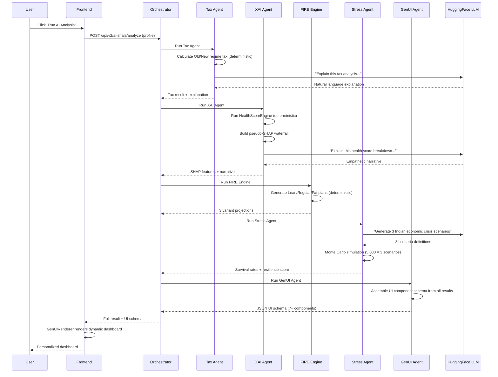

<div align="center">

# Finshala

**AI-powered financial wellness for India's 150M+ retail investors.**

*Economic Times GenAI Hackathon 2026 — Finance & Fintech Track*

[](https://youtu.be/EZbtbZWgScs)
&nbsp;
[](https://react.dev)
[](https://typescriptlang.org)
[](https://python.org)
[](https://flask.palletsprojects.com)
[](https://supabase.com)

</div>

---

## What is Finshala?

A personal financial advisor costs ₹25,000–₹50,000/year. Generic apps give the same advice to everyone. **Finshala does neither.**

It combines deterministic computation engines (for accurate math) with AI agents (for personalized explanation) — giving every Indian investor advice that was previously only available to the wealthy.

> **Core principle: LLMs explain. They never calculate.**
> All tax math, SIP projections, and Monte Carlo simulations run through deterministic Python engines. AI only generates the narrative — no hallucinated numbers.

---

## Features

### 🔥 FIRE Path Planner
Month-by-month retirement projections across three scenarios — Lean, Regular, and Fat FIRE — with age-based asset allocation, SIP breakdowns by fund type, and milestone tracking up to age 85.

### 💯 Money Health Score
A 0–900 score across 6 weighted dimensions: emergency preparedness, insurance coverage, investment diversification, debt health, tax efficiency, and retirement readiness. Each dimension returns specific findings and ranked action items.

### 🧾 Tax Wizard
Upload your Form 16 PDF (including password-protected). Finshala extracts your salary and deductions, compares Old vs New regime tax, finds unused 80C/80D/NPS deductions, and explains the recommendation in plain language.

### 🧠 AI Shala — Multi-Agent Pipeline

Five specialized agents run sequentially on your profile:

```
Tax Agent → XAI Agent → FIRE Agent → Stress Agent → GenUI Agent
```

| Agent | What it does |
|-------|-------------|
| Tax Agent | Calculates both regimes, calls LLM to explain the delta |
| XAI Agent | Runs health score, builds a SHAP-style waterfall decomposition |
| FIRE Agent | Generates Lean / Regular / Fat projections (pure deterministic) |
| Stress Agent | LLM generates 3 Indian crisis scenarios → 5,000 Monte Carlo runs each |
| GenUI Agent | Assembles a dynamic dashboard schema from all results |

**Example SHAP output:**
```
Base score (population avg):  480 / 900
  + Tax Efficiency            +58  ← your strongest area
  + Debt Health               +42
  − Emergency Fund            −72  ← only 1.4 months covered
  − Insurance Coverage        −61  ← no life insurance
  ─────────────────────────────────
  Your score:                 424 / 900  (Fair)
```

### 💬 AI Chatbot
Conversational assistant for Indian tax and investment questions. Runs Ollama locally (`llama3.1:8b`) with automatic fallback to HuggingFace inference if Ollama isn't available.

### 📄 PDF Reports
Server-generated branded reports via ReportLab — FIRE roadmap, Tax comparison, and Health Score breakdown. Download and share offline.

---

## Tech Stack

| Layer | Technologies |
|-------|-------------|
| Frontend | React 18, TypeScript, Vite 5, Tailwind CSS, shadcn/ui, Framer Motion, Three.js, Recharts |
| Backend (Node.js) | Express 4 — LLM proxy gateway |
| Backend (Python) | Flask 3.1, pdfplumber, pikepdf, ReportLab, NumPy, httpx |
| AI / LLM | Ollama (llama3.1:8b), HuggingFace Inference API, Meta Llama 3.1 8B, Phi-3.5 Mini |
| Auth & DB | Supabase |

---

## Project Structure

```
finshala/
├── frontend/               # React + Vite app
│   └── src/
│       ├── pages/          # FIRE, Health, Tax Wizard, AI Shala
│       ├── components/     # UI components + GenUIRenderer
│       ├── services/       # Computation engines (TypeScript)
│       └── hooks/          # useAuth, useUserProfile
│
└── backend/
    ├── server.js           # Node.js — LLM proxy (Express)
    └── python_api/         # Flask — all financial engines
        ├── app.py
        ├── fire_engine.py
        ├── health_score_engine.py
        ├── report_generator.py
        └── ai_shala/
            ├── orchestrator.py
            ├── llm_client.py
            └── agents/     # tax, xai, stress, genui
```

---

## Running Locally

**Prerequisites:** Node.js 20+, Python 3.11+, and optionally [Ollama](https://ollama.ai)

```bash
# Clone
git clone https://github.com/aarayann/finshala.git
cd finshala

# Frontend
cd frontend && npm install && npm run dev

# Node.js backend
cd ../backend && npm install && node server.js

# Python backend
cd python_api && pip install -r requirements.txt && python app.py

# (Optional) Ollama chatbot
ollama pull llama3.1:8b && ollama serve
```

Copy `.env.example` to `.env` in `backend/` and fill in your `HUGGINGFACE_API_KEY` and Supabase credentials.

**API health checks:**
```bash
curl http://localhost:3000/api/health   # Node.js
curl http://localhost:5000/api/health   # Flask
curl http://localhost:5000/api/v2/ai-shala/health
```

---

## Impact

| Who | Problem solved | Estimated saving |
|-----|---------------|-----------------|
| Salaried professional (₹8–15 LPA) | Wrong tax regime + missed deductions | ₹25,000–₹65,000/year |
| Young investor (25–35) | No FIRE plan or emergency fund | ₹10L+ corpus started |
| Family with loans | Unaware of 36% credit card cost | ₹12,000–₹40,000/year |
| Mid-career (35–45) | Inadequate insurance | ₹5–30L medical risk covered |

~40 million Indians file the wrong tax regime every year. Average overpayment: ₹25,000–₹60,000.

---

## Team

| Name | LinkedIn |
|------|----------|
| Aryan Chauhan | [aarayann](https://www.linkedin.com/in/aarayann/) |
| Bhavya Sodhi | [bhavya-sodhi](https://www.linkedin.com/in/bhavya-sodhi-7a60372bb/) |
| Harsh Mittal | [harshm1111](https://www.linkedin.com/in/harshm1111/) |
| Härshit Bhalia | [härshit-bhalia](https://www.linkedin.com/in/h%C3%A4rshit-bhalia-76319128a/) |

---

<div align="center">

Built with ❤️ for India's financial future &nbsp;·&nbsp; ET GenAI Hackathon 2026

</div>


<h1 align="center">Finshala</h1>

<p align="center">
  <b>AI-Powered Financial Wellness for 150M+ Indian Retail Investors</b><br />
  <i>Economic Times GenAI Hackathon 2026 — Finance & Fintech Track</i>
</p>

<p align="center">
  <a href="https://youtu.be/EZbtbZWgScs" target="_blank">
    
  </a>

  <a href="#-ai-shala--agentic-intelligence">
    
  </a>
</p>

<p align="center">
  
  
  
  
  
  
  
  
  
</p>

---

## 📋 Table of Contents

- [The Problem We Solve](#-the-problem-we-solve)
- [What Finshala Does](#-what-finshala-does)
- [Core Features](#-core-features)
- [AI Shala — Agentic Intelligence](#-ai-shala--agentic-intelligence)
- [System Architecture](#-system-architecture)
- [Tech Stack](#-tech-stack)
- [Project Structure](#-project-structure)
- [API Reference](#-api-reference)
- [GenAI Integration Deep Dive](#-genai-integration-deep-dive)
- [Business Impact & ROI](#-business-impact--roi)
- [Scalability & Cost Analysis](#-scalability--cost-analysis)
- [Screenshots](#-screenshots)
- [Roadmap](#-roadmap)
- [Team](#-team)
- [Acknowledgments](#-acknowledgments)
---

## ↦ The Problem We Solve

India has **150+ million retail investors**, and this number is growing every day. But most of these people face a big problem:

> **Financial advice is either too expensive for normal people, or too generic to be useful.**

- A personal financial advisor in India charges ₹15,000–₹50,000 per year too costly for a young professional earning ₹6–12 LPA.
- Free online tools give the same advice to everyone: *"Invest in ELSS"*, *"Start a SIP"* — without knowing your actual salary, loans, tax situation, or goals.
- Most Indians don't know if they are using the right tax regime. The difference between Old and New regime can be ₹30,000–₹80,000 per year real money that gets lost.
- Nobody explains **why** their financial health is good or bad you get a number but not the reasoning behind it.

### The Information Gap in Numbers

| Problem | Scale |
|---------|-------|
| Indians who file wrong tax regime annually | ~40 million |
| Average tax overpayment per person (wrong regime) | ₹25,000–₹60,000 |
| Young professionals with zero financial plan | 78% (under age 35) |
| Average cost of a certified financial planner | ₹25,000/year |
| People who abandon financial apps due to complexity | 65% |

**Finshala bridges this gap.** We use Generative AI to give every Indian the kind of personalized data driven financial guidance that was previously available only to the wealthy.

---

## ↦ What Finshala Does

Finshala is a financial wellness platform that combines **deterministic computation engines** (for accurate math) with **Generative AI agents** (for personalized advice and explanations). No hallucinated numbers the LLMs explain they never calculate.

### In Simple Words

You enter your financial details once. Finshala then:

1. **Scans your tax situation** → Tells you which regime saves more money and exactly where you are missing deductions
2. **Checks your financial health** → Gives you a score out of 900 across 6 dimensions
3. **Plans your retirement** → Shows you exactly when you can retire early (FIRE), how much SIP you need, and what happens year by year
4. **Explains everything with AI** → Not just numbers but *why* your score is what it is, using SHAP style explainable AI
5. **Stress-tests your money** → Runs 5,000 Monte Carlo simulations against AI generated economic crisis scenarios
6. **Generates PDF reports** → Professional downloadable reports for Tax, Health Score, and FIRE planning


## 🔥 Core Features

### 1. FIRE Path Planner — *Journey to Financial Independence*

The FIRE (Financial Independence Retire Early) engine calculates three retirement scenarios based on your real data:

| Variant | What It Means | Example Target |
|---------|--------------|----------------|
| 🌿 **Lean FIRE** | Basics only — no dining out, no vacations | ₹1.4 Cr by age 38 |
| 🔥 **Regular FIRE** | Keep your current lifestyle without working | ₹3.7 Cr by age 44 |
| 👑 **Fat FIRE** | Premium living — international travel, luxury | ₹7.2 Cr by age 50 |

**What makes it special:**
- Month by month simulation up to age 85
- Age based asset allocation glide path (more equity when young more debt when older)
- SIP breakdown by fund type (flexi cap, mid cap, ELSS, debt, gold ETF)
- Automatic milestone tracking (25% done → Coast FIRE → 50% → FIRE achieved)
- Built in insurance gap analysis (life + health + critical illness)
- Tax regime comparison embedded in the FIRE plan
- Emergency fund strategy with specific parking recommendations

### 2. Money Health Score — *Your 6-Dimension Financial Pulse*

A comprehensive score from 0 to 900:

| Dimension | Weight | What It Measures |
|-----------|--------|-----------------|
| Emergency Preparedness | 20% | Months of expenses covered by liquid savings |
| Insurance Coverage | 20% | Life, health, and critical illness adequacy |
| Investment Diversification | 15% | Asset classes, concentration risk, SIP discipline |
| Debt Health | 15% | EMI-to-income ratio, debt quality (secured vs unsecured) |
| Tax Efficiency | 15% | 80C/80D/NPS utilization, regime optimization |
| Retirement Readiness | 15% | Corpus progress, SIP adequacy, years to goal |

Each dimension gives you:
- A sub score with detailed breakdown
- Specific findings (positive, warning, critical)
- Prioritized, actionable recommendations with estimated impact

### 3. Tax Wizard — *AI-Driven Regime Optimization*

- **Upload your Form 16 PDF** → Automatically extracts salary, deductions, TDS (handles password-protected PDFs too)
- **Old vs New Regime comparison** → Shows exact tax under both, recommends the better one
- **Missed deduction finder** → Scans 80C, 80CCD(1B), 80D, Section 24(b) and tells you exactly how much more to invest
- **Slab by slab breakdown** → See how tax is calculated at each income slab
- **AI explanation** → LLM explains in plain language *why* one regime is better for your specific situation

### 4. AI Chatbot — *Your Personal Finance Assistant*

A conversational AI assistant powered by **Ollama (Llama 3.1 8B)** for local inference:
- Answers tax questions in context of Indian law
- Gives investment advice using Indian products (SIP, ELSS, PPF, NPS)
- Explains financial concepts in simple Hindi/English
- Keeps conversation history for follow-up questions
- Falls back to HuggingFace API if Ollama is not running

### 5. 📄 PDF Report Generator

Professional, branded reports generated on the server using Python ReportLab:
- **FIRE Report** — 11 sections covering everything from profile snapshot to 20-year roadmap
- **Tax Report** — Regime comparison, deduction utilization, missed savings
- **Health Score Report** — 6-dimension breakdown, findings, prioritized action plan

---

## AI Shala — Agentic Intelligence

**AI Shala** is the heart of Finshala's GenAI innovation. It is a **multi agent orchestration system** where 5 specialized AI agents collaborate in a sequential pipeline to analyze your finances from every angle.

### How the Agent Pipeline Works

```
User Profile → [Tax Agent] → [XAI Agent] → [FIRE Agent] → [Stress Agent] → [GenUI Agent] → Dynamic Dashboard
```

Each agent adds its results to a shared state. The pipeline runs end to end and produces a dynamic dashboard that is different for every user.

### The Five Agents

| # | Agent | What It Does | Engine Type |
|---|-------|-------------|-------------|
| 1 |  **Tax Agent** | Calculates Old vs New regime tax, finds deduction gaps, asks LLM to explain | Deterministic + LLM narrative |
| 2 |  **XAI Agent** | Runs Health Score engine, decomposes into SHAP-style waterfall | Deterministic + LLM narrative |
| 3 |  **FIRE Agent** | Generates Lean/Regular/Fat FIRE projections | Pure deterministic (Python) |
| 4 |  **Stress Agent** | LLM generates 3 economic crisis scenarios, Monte Carlo simulates 5,000 runs each | LLM scenarios + Monte Carlo math |
| 5 |  **GenUI Agent** | Reads all results and assembles them

### Key Design Principle

> **LLMs explain. They NEVER calculate.**
>
> All financial math (tax slabs, compound interest, SIP projections, Monte Carlo simulations) runs through deterministic Python engines. The LLMs only generate human-readable narratives and scenario descriptions. This prevents hallucinated numbers a critical requirement for financial applications.

### Explainable AI (XAI) — SHAP-Style Decomposition

The XAI Agent does not just give you a health score it shows you exactly **which dimensions pushed your score up or down** similar to SHAP (SHapley Additive exPlanations) values in ML:

```
Base Score (Population Average): 480/900
  + Tax Efficiency:        +58 points  (Your strongest area)
  + Debt Health:           +42 points   
  - Emergency Fund:        -72 points  (Only 1.4 months covered)
  - Insurance Coverage:    -61 points  (No life insurance)
  - Retirement Readiness:  -35 points  
  + Investment:            +12 points
  ────────────────────────────────────
  Your Score:              424/900     (Fair)
```

### Monte Carlo Stress Testing

The Stress Agent generates realistic Indian economic crisis scenarios using GenAI, then runs **5,000 random simulations** for each scenario:

**Example scenarios generated by the LLM:**
1.  *Indian Stagflation 2028* — Inflation hits 9.5%, equity returns drop to 4% for 5 years
2.  *Market Correction 2029* — 35% crash from global tech bubble, 3-year slow recovery
3.  *Black Swan Pandemic 2030* — 15% salary cuts, 8% inflation, extreme volatility for 2 years

For each scenario, you get:
- **Survival probability** — Will your money last until retirement?
- **Median final corpus** — Most likely outcome
- **Worst case (5th percentile)** — What happens if everything goes wrong
- **Resilience score** — Overall stress resistance rating

### Generative UI (GenUI)

The GenUI Agent reads all analysis results and dynamically builds a component schema.

Components generated include:
- `HealthScoreGauge` — Always shown
- `ShapWaterfall` — Always shown (key differentiator)
- `StressTestSimulator` — If stress results exist
- `TaxOptimizationCard` — If there are tax savings available
- `FireTrajectoryChart` — If FIRE data exists
- `DebtAvalancheModule` — Only if EMI-to-income ratio is concerning
- `ActionableCards` — Always shown with prioritized next steps

---

## 🏗️ System Architecture

### High-Level Architecture (C4 — Level 1: System Context)


### Detailed Architecture (C4 — Level 2: Container)

```mermaid
graph LR
    subgraph Frontend["Frontend (React + Vite)"]
        Pages[" Pages<br/>Index, FIRE, Health,<br/>Tax Wizard, AI Shala"]
        Components[" Components<br/>HeroPanels, Navbar,<br/>GenUIRenderer, Chatbot"]
        Services[" Services<br/>fire-engine.ts<br/>health-score-engine.ts<br/>tax-wizard-engine.ts<br/>llm-service.ts"]
        Hooks[" Hooks<br/>useAuth, useUserProfile,<br/>useCountUp"]
    end
    
    subgraph NodeBackend["Node.js Backend (Express)"]
        HealthAPI["GET /api/health"]
        LLMProxy["POST /api/llm/proxy"]
        StaticServe["Static File Serving<br/>(Production)"]
    end
    
    subgraph PythonBackend["Python Backend (Flask)"]
        Form16["POST /api/parse-form16<br/>PDF Parser (pdfplumber)"]
        HealthScore["POST /api/calculate-health-score<br/>6-Dimension Engine"]
        FIREPlan["POST /api/calculate-fire-plan<br/>FIRE Engine"]
        Reports["POST /api/generate-report/:type<br/>PDF Generator (ReportLab)"]
        Chat["POST /api/chat<br/>Ollama Chatbot"]
        
        subgraph AIShala["AI Shala Module"]
            Orchestrator[" Orchestrator"]
            TaxAgent[" Tax Agent"]
            XAIAgent[" XAI Agent"]
            StressAgent[" Stress Agent"]
            GenUIAgent[" GenUI Agent"]
            LLMClient[" LLM Client<br/>(HuggingFace Router)"]
        end
    end
    
    Pages --> Services
    Pages --> Hooks
    Services --> NodeBackend
    Services --> PythonBackend
    Orchestrator --> TaxAgent
    TaxAgent --> XAIAgent
    XAIAgent --> StressAgent
    StressAgent --> GenUIAgent
    TaxAgent --> LLMClient
    XAIAgent --> LLMClient
    StressAgent --> LLMClient
    
    style Frontend fill:#f0f9ff,stroke:#61DAFB
    style NodeBackend fill:#f0fff0,stroke:#339933
    style PythonBackend fill:#f0f0ff,stroke:#3776AB
    style AIShala fill:#fdf8f022,stroke:#8B6F47,stroke-width:2px,stroke-dasharray: 5 5
```



### AI Shala — Agent Pipeline Flow



---

## 🛠️ Tech Stack

### Frontend

| Technology | Purpose |
|-----------|---------|
| **React 18** + **TypeScript** | UI framework with type safety |
| **Vite 5** | Fast build tool with HMR (hot module replacement) |
| **Tailwind CSS** + **shadcn/ui** | Styling system with accessible Radix UI components |
| **Framer Motion** + **GSAP** | Smooth animations and micro-interactions |
| **Three.js** | 3D shader effects for hero background |
| **Recharts** | Interactive financial charts and graphs |
| **React Router 6** | Client-side page routing |
| **TanStack Query** | Server state management and caching |
| **Supabase JS** | Authentication (email, OAuth) |
| **Zod** + **React Hook Form** | Form validation |

### Backend — Node.js

| Technology | Purpose |
|-----------|---------|
| **Express 4** | API gateway and static file serving |
| **CORS** | Cross-origin request handling |
| **dotenv** | Environment variable management |

### Backend — Python

| Technology | Purpose |
|-----------|---------|
| **Flask 3.1** | REST API framework |
| **pdfplumber** | Form 16 PDF text extraction |
| **pikepdf** | Password-protected PDF handling |
| **ReportLab** | Professional PDF report generation |
| **httpx** | Async HTTP client for LLM API calls |
| **NumPy** | Monte Carlo simulation math |

### AI / LLM

| Technology | Purpose |
|-----------|---------|
| **Ollama** (llama3.1:8b) | Local fast inference for chatbot |
| **HuggingFace Router v1** | Cloud LLM inference for AI Shala agents |
| **Meta Llama 3.1 8B** | Primary model for agent narratives |
| **Microsoft Phi-3.5 Mini** | Fast fallback model |


### Infrastructure

| Technology | Purpose |
|-----------|---------|
| **Supabase** | Authentication, user data, and future database needs |
| **Vitest** | Unit testing framework |
| **Playwright** | End-to-end browser testing |
| **ESLint** | Code quality and linting |

---


## 📁 Project Structure

```
finshala/
├── frontend/
│   ├── src/
│   │   ├── App.tsx
│   │   ├── main.tsx
│   │   ├── index.css
│   │   ├── pages/
│   │   │   ├── Index.tsx
│   │   │   ├── FireDashboard.tsx
│   │   │   ├── MoneyHealthPage.tsx
│   │   │   ├── TaxWizardPage.tsx
│   │   │   ├── AiShalaPage.tsx
│   │   │   ├── Account.tsx
│   │   │   └── NotFound.tsx
│   │   ├── components/
│   │   │   ├── Navbar.tsx
│   │   │   ├── HeroPanels.tsx
│   │   │   ├── FeatureFirePath.tsx
│   │   │   ├── FeatureMoneyHealth.tsx
│   │   │   ├── FeatureTaxWizard.tsx
│   │   │   ├── FeatureAiShala.tsx
│   │   │   ├── AuthModal.tsx
│   │   │   ├── ProfileGate.tsx
│   │   │   ├── ai-shala/
│   │   │   │   └── GenUIRenderer.tsx
│   │   │   ├── health-score/
│   │   │   ├── tax-wizard/
│   │   │   ├── onboarding/
│   │   │   └── ui/
│   │   │       ├── GlobalChatbot.tsx
│   │   │       ├── PulsingCircle.tsx
│   │   │       ├── liquid-glass.tsx
│   │   │       ├── hero-section-with-smooth-bg-shader.tsx
│   │   │       ├── orbiting-skills.tsx
│   │   │       ├── modern-animated-hero-section.tsx
│   │   ├── services/
│   │   │   ├── fire-engine.ts
│   │   │   ├── health-score-engine.ts
│   │   │   ├── tax-wizard-engine.ts
│   │   │   ├── llm-service.ts
│   │   │   ├── form16-parser.ts
│   │   │   └── pdf-generator.ts
│   │   ├── hooks/
│   │   │   ├── useAuth.tsx
│   │   │   ├── useUserProfile.ts
│   │   │   ├── useCountUp.ts
│   │   │   └── use-mobile.tsx
│   │   └── data/
│   │       └── fireMockData.ts
│   ├── package.json
│   ├── tailwind.config.ts
│   ├── vite.config.ts
│   └── vitest.config.ts
│
├── backend/
│   ├── server.js
│   ├── package.json
│   ├── .env.example
│   └── python_api/
│       ├── app.py
│       ├── fire_engine.py
│       ├── health_score_engine.py
│       ├── report_generator.py
│       ├── requirements.txt
│       ├── ai_shala/
│       │   ├── __init__.py
│       │   ├── orchestrator.py
│       │   ├── llm_client.py
│       │   ├── routes.py
│       │   └── agents/
│       │       ├── tax_agent.py
│       │       ├── xai_agent.py
│       │       ├── stress_agent.py
│       │       └── genui_agent.py
│       └── test_*.py
│
├── .gitignore
└── README.md
```

## 🤖 GenAI Integration Deep Dive

### How We Use AI — The "Math ≠ LLM" Principle

Finshala follows a strict separation between **mathematical computation** and **language generation**:

```
┌──────────────────────────┐     ┌──────────────────────────┐
│  DETERMINISTIC ENGINES   │     │  GENERATIVE AI (LLMs)    │
│  (Python / TypeScript)   │     │  (HuggingFace / Ollama)  │
├──────────────────────────┤     ├──────────────────────────┤
│  Tax slab calculations │       │  Explain WHY one regime │
│  Compound interest     │       │    is better            │
│  SIP projections       │       │  Generate crisis        │
│  Monte Carlo sims      │       │    scenario descriptions│
│  Health scoring logic  │       │  Write health score     │
│  FIRE number math      │       │    narratives           │
│  Never asks LLM for   │        │    Answer user questions│
│    a number              │     │  Never does math        │
└──────────────────────────┘    └──────────────────────────┘
```

### LLM Model Strategy

We use **multiple models** with automatic fallback chains — so the app keeps working even if one model is down:

**Python Backend (AI Shala Agents):**
```
Primary:  Meta Llama 3.1 8B Instruct (via Novita)
Fast:     Microsoft Phi-3.5 Mini Instruct (via Novita)
```

**Frontend (LLM Service):**
```
Parser:     Qwen 2.5 Coder 7B → Qwen 72B
Chatbot:    Ollama llama3.1:8b (local) → HF fallback
```

### Prompt Engineering Highlights

Every LLM call uses carefully crafted system prompts. For example, the Tax Agent prompt:

```
You are a Chartered Accountant AI specializing in Indian Income Tax (FY 2024-25).
Explain tax recommendations clearly in 3-4 sentences.
Use INR amounts. Be specific.
```

The XAI Agent uses a different tone:

```
You are a financial wellness coach.
Explain health scores in a warm, motivational yet honest tone.
Use Indian financial context.
Keep to 4-5 sentences maximum.
```

This task-specific prompting ensures that each agent sounds different and appropriate for its role.

---

## 📊 Business Impact & ROI

### Who Benefits and How Much They Save

| User Segment | Problem Solved | Estimated Annual Saving |
|-------------|---------------|----------------------|
| **Salaried Professional** (₹8–15 LPA) | Wrong tax regime + missed 80C/80D deductions | ₹25,000 – ₹65,000/year |
| **Young Investor** (25–35 years) | No FIRE plan, no emergency fund awareness | Starts building ₹10L+ corpus over 5 years |
| **Family with Loans** | Doesn't know credit card debt costs 36% interest | Saves ₹12,000 – ₹40,000/year by prioritizing payoff |
| **Mid-Career Professional** (35–45) | Inadequate insurance coverage | Prevents ₹5–30L out-of-pocket medical expenses |

### Impact Math (Conservative Estimates)

```
Time to complete FIRE onboarding:             ~8 minutes
Time with a traditional financial planner:    ~3 hours + ₹5,000 consultation fee

Time saved per user:                          2 hours 52 minutes
Value of time saved (at ₹500/hr):             ₹1,430 per user

If 10,000 users complete onboarding:
  Total time saved:                           28,666 hours
  Total consultation fees saved:              ₹5,00,00,000 (₹5 Cr)
  Average tax savings identified:             ₹35,000 × 10,000 = ₹35 Cr
```

### India-First Problem Alignment

| ET Hackathon Theme | How Finshala Addresses It |
|-------------------|--------------------------|
| **Financial Inclusion** | Free access to advice that used to cost ₹25K/year. Works in simple English — no jargon. |
| **Digital India** | Fully web-based, works on any device. PDF reports work offline. No app download needed. |
| **Youth Empowerment** | FIRE planning helps 25-year-olds see a realistic path to retirement by 40–45. |
| **Tax Efficiency** | Directly prevents ₹25K–₹60K annual tax overpayment for millions of Indians. |

---


## 📸 Screenshots

### Tax Wizard


### AI Shala — Agentic Pipeline


---

## 🧪 Testing

### Run Unit Tests

```bash
cd frontend
npm run test          # Single run
npm run test:watch    # Watch mode
```

### Test the Python API

```bash
cd backend/python_api
python test_all_apis.py    # Tests all API endpoints
python test_engine.py      # Tests FIRE engine
python test_llm.py         # Tests LLM connectivity
```

### API Health Checks

```bash
# All three services should return {"status": "ok"}
curl http://localhost:3000/api/health      # Node.js
curl http://localhost:5000/api/health      # Python
curl http://localhost:5000/api/v2/ai-shala/health  # AI Shala
```

---


## 👥 Team

<!-- Add your team details here -->

| Name | LinkedIn |
|----- | -------|
| Bhavya Sodhi  | [Profile](https://www.linkedin.com/in/bhavya-sodhi-7a60372bb/) |
| Aryan Chauhan | [Profile](https://www.linkedin.com/in/aarayann/) |
| Harsh Mittal | [Profile](https://www.linkedin.com/in/harshm1111/) |
| Härshit Bhalia | [Profile](https://www.linkedin.com/in/h%C3%A4rshit-bhalia-76319128a/) |


---

## 🙏 Acknowledgments

- **Economic Times & Unstop** — For organizing the ET GenAI Hackathon 2026
- **HuggingFace** — For the free inference API that makes GenAI accessible to everyone
- **Meta AI** — For open-sourcing Llama 3.1
- **Ollama** — For making local LLM inference simple
- **Supabase** — For the generous free tier on authentication and database
- **shadcn/ui** + **Radix UI** — For the beautiful, accessible component library
- **The open-source community** — For React, Vite, Flask, ReportLab, and hundreds of other tools that made this possible

---


<p align="center">
  <b>Built with ❤️ for India's financial future</b><br />
  <i>ET GenAI Hackathon 2026 — Finance & Fintech Track</i>
</p>

<p align="center">
  
</p>
